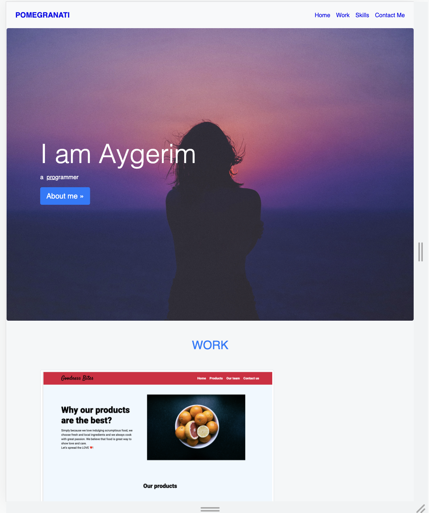

# portfolio-with-bootstrap
## Portfolio project build with Bootstrap CSS Framework 

This portfolio-with-bootstrap showcase my understanding of using Bootstrap library, by reading documentation and using ready written css components. 

## Installation 

## Usage

The following image shows the web application's appearance and functionality:

This version of my portfolio webpage includes a navbar,jumbotron, work section with grid cards, skills sections with icons, about me and contact me section.

Navigate to <https://anarab.github.io/portfolio-b/> to find the  webpage. 

## Credits

This site was built using [Bootsrap 4.0] (https://getbootstrap.com/docs/4.0/getting-started/introduction/).

TinDog website was build by me with the guidance and example website during the course "The Complete 2023 Web Development Bootcamp" by Angela Yu on Udemy

Jumbotron image was downloaded from Unsplash website. 

My GitHub repository page
<https://github.com/AnaraB/portfolio-with-bootstrap>

## License
MIT 

